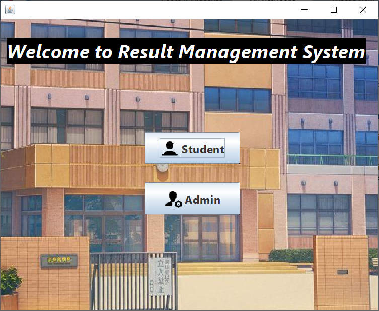
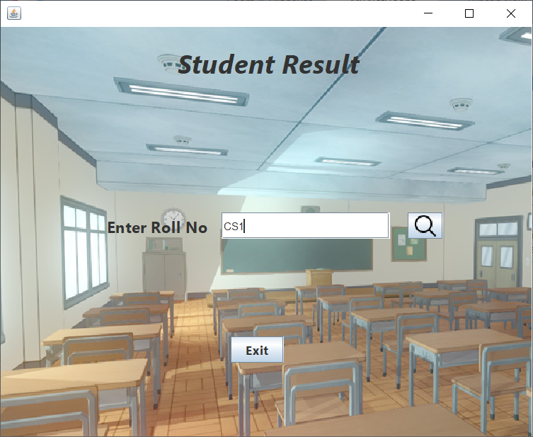
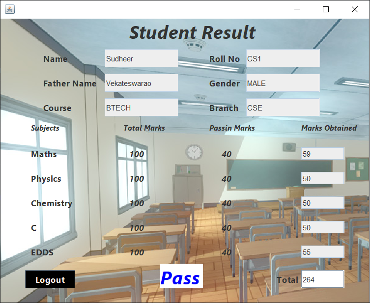
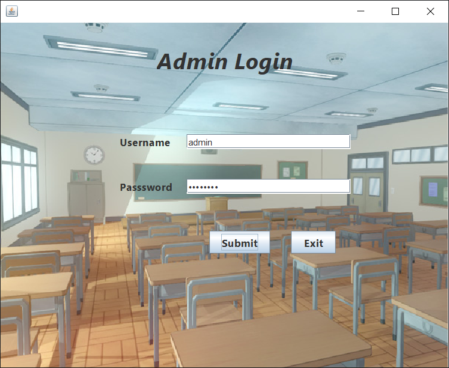
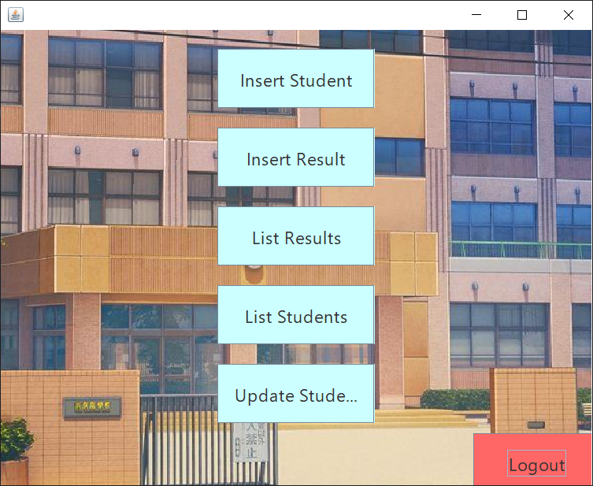
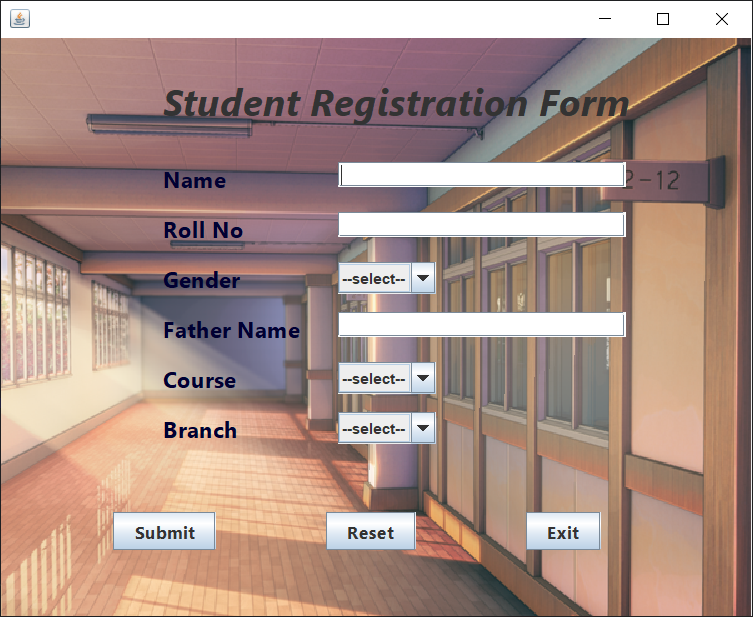
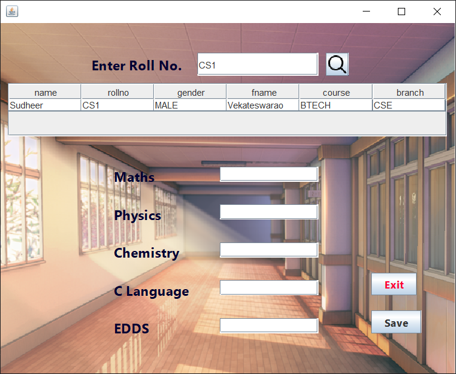
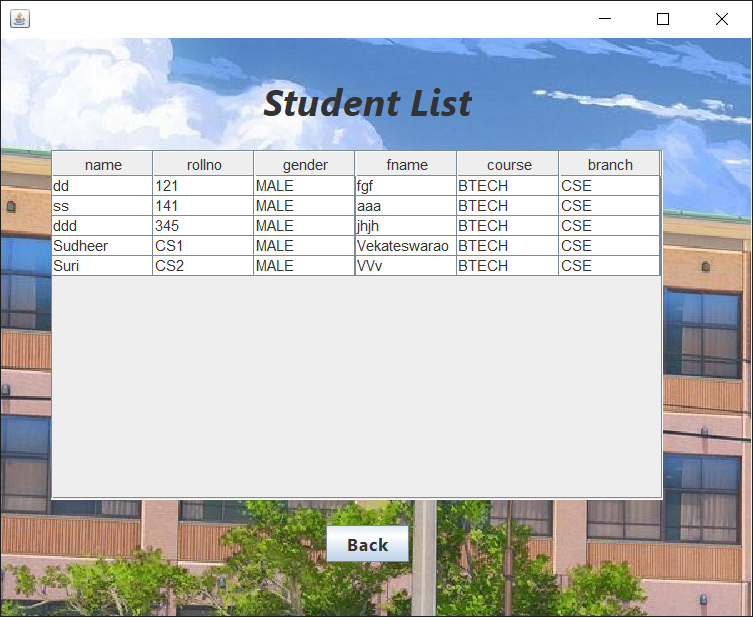
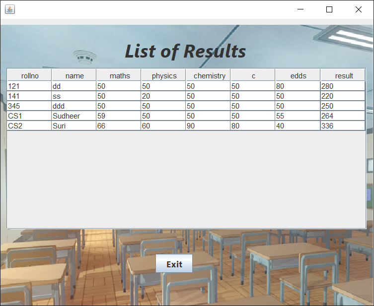
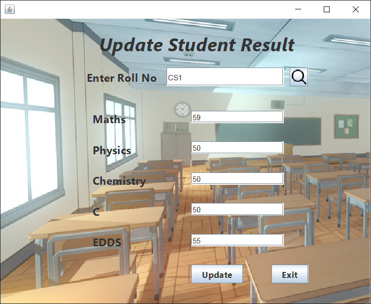

# Student Result Management System

This is a java based application which contains 2 main modules 'Student' module and 'admin' where the students allowed view their results through student module by entering their Roll Number. The admin is the one who is responsible for adding new students, updating student details, Giving marks and updating marks.

Java Swing && Java AWT

MySql Database.

        

